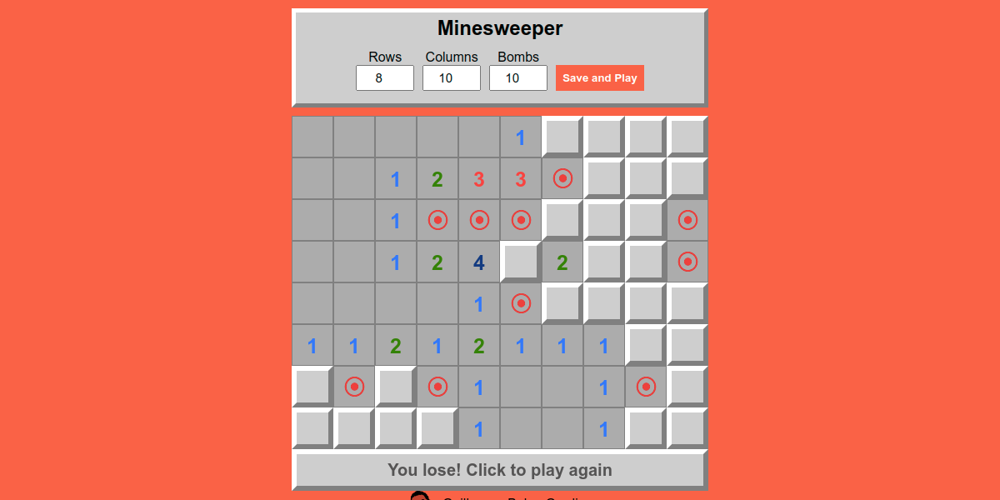

# Minesweeper

Web version of the classic Minesweeper



## Getting Started

- Clone the repository with

```bash
git clone https://github.com/GuilhermeBalog/minesweeper.git
```

- Open the `index.html` file on your favorite browser!

## How it works...

### Set up

The whole game works inside the Game object

```js
const Game = {...}
```

There are some main attributes:

```json
width: 10,
height: 8,
bombs: 10,
field: [],
gameOver: false,
```

I decided that the field array would be a one dimension array, so its length is `width * height`.

Each cell has a value (0 is the default) that represents how many bombs there are around it and a boolean attribute to control if it's open

### initializing the field

```js
// snippet of the initField() method
for (let i = 0; i < this.field.length; i++) {
  this.field[i] = { opened: false, value: 0 }
}
```

### Placing the bombs

To place the bombs randomly, the value of `field[0]` to `field[bombs - 1]` is -1 (bomb!), and then the array is [random sorted](https://www.w3schools.com/js/js_array_sort.asp)

```js
// snippet of the placeBombs() method
for (let i = 0; i < this.bombs; i++) {
  this.field[i].value = -1
}
this.field.sort((a, b) => {
  return 0.5 - Math.random()
})
```

### Placing the numbers

Now it's the magic time! how to place the numbers? The numbers represents how many bombs there around each cell, or -1 if its a bomb

There are 3 main main methods in this process:

```js
getAroundIndexes()
countBombs()
placeNumbers()
```

- `getAroundIndexes` returns an array with the valid indexes of the around cells
- `countBombs` iterates the `aroundIndexes` and returns the amount of `-1`
- And `placeNumbers` calls `countBombs` for each cell that is not a bomb

### Opening Cells

When the player open a cell there are 3 basic options: its a bomb, or its a number between 1 and 8, or its a zero

- if its a bomb, all the others bombs are opened too and the game is ended
- if its a number between 1 and 8 just the selected cell is opened
- if its a zero all the non-bomb cells around are opened recursively

In any case `opened` attribute of the cell is set to `true`

```js
//snippet of the openCell(index) method
this.field[index].opened = true

if (this.hasBombAt(index)) {
    this.openAllBombs()
    this.gameOver = true
    return
}

if (this.field[index].value == 0) {
    const aroundIndexes = this.getAroundIndexes(index)
    aroundIndexes.forEach(i => {
        if (this.field[i].value != -1) {
            this.openCell(i)
        }
    })
}
```

### Finishing the game

The game is finished when the player loses opening a bomb or wins when all the non-bomb cells are opened

```js
checkWin: function () {
    const closedCells = this.field.filter(cell => {
        return cell.opened == false
    })
    if (closedCells.length == this.bombs) {
        this.gameOver = true
    }
}
```

### Visual Methods

I tried to make a low coupling program, splitting data methods and visual methods, so the visual methods doesn't change the data.

The main visual method is `draw`. It render the controls and the field and it's called by many other methods.

`createFieldElement` returns a HTML element with the rendered game field as a table.

The bombs are rendered as &ofcir; characters and the zeros are rendered as white spaces

> Check the [index.js file](https://github.com/GuilhermeBalog/minesweeper/blob/master/index.js) and feel free to fork this repo and add your ideias!

*That's all folks! Keep coding!*
